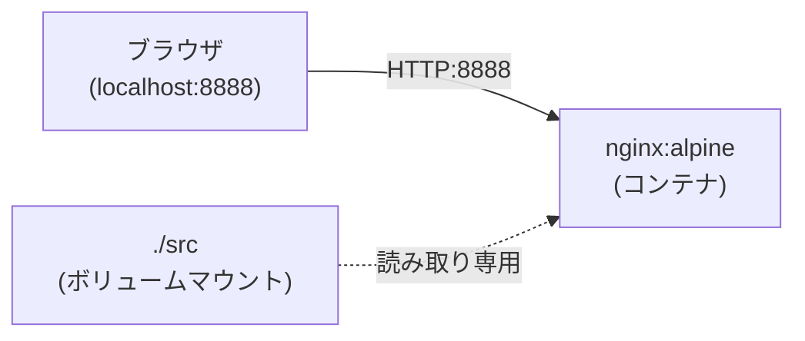
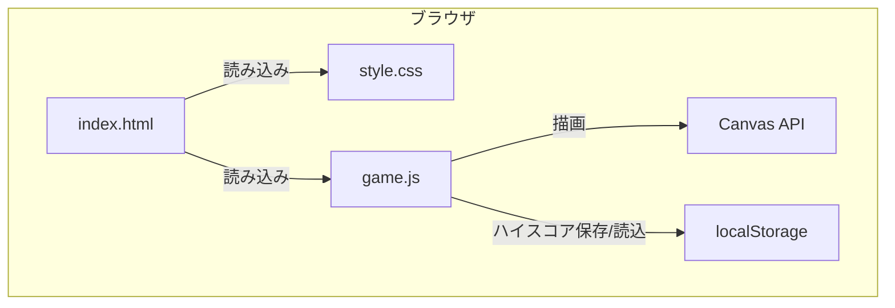
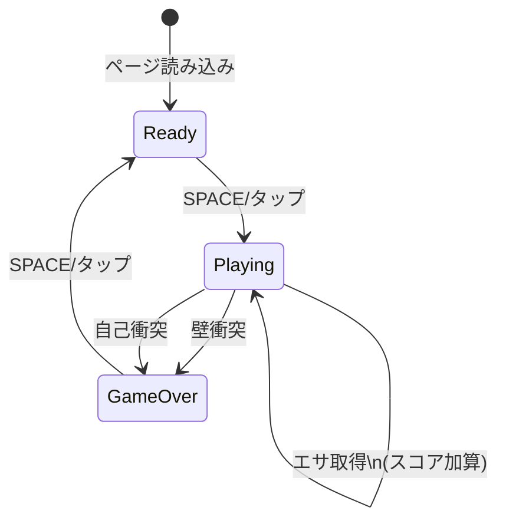

# アーキテクチャドキュメント

## ディレクトリ構成

```
snake-game/
├── PROMPT.md           # 要求仕様
├── README.md           # プロジェクト概要
├── CONVERSATION.md     # 対話ログ
├── Dockerfile          # コンテナイメージ定義
├── docker-compose.yml  # コンテナ実行設定
├── .gitignore          # 除外ファイル設定
├── doc/
│   └── architecture.md # 本ドキュメント
└── src/
    ├── index.html      # メインページ
    ├── style.css       # スタイルシート
    ├── game.js         # ゲームロジック
    └── summary.html    # プロンプト要約ページ
```

## 使用ライブラリ

| ライブラリ | バージョン | 用途 |
|-----------|-----------|------|
| なし | - | バニラ JavaScript で実装 |

外部ライブラリは一切使用せず、HTML5 Canvas API と標準 JavaScript のみで構成。

## コンテナレベルのデータフロー



## モジュールレベルのデータフロー



## 状態遷移図



## ゲームロジック

### メインループ

1. 次の方向を現在の方向に適用
2. 新しい頭の位置を計算
3. 壁衝突 / 壁抜け判定
4. 自己衝突判定
5. スネーク移動（頭を追加）
6. エサ判定（取得なら伸びる、なければ尾を削除）
7. 描画

### レベルシステム

- 50点ごとにレベルアップ
- レベルアップで移動速度が10ms短縮
- 最低速度は50ms
